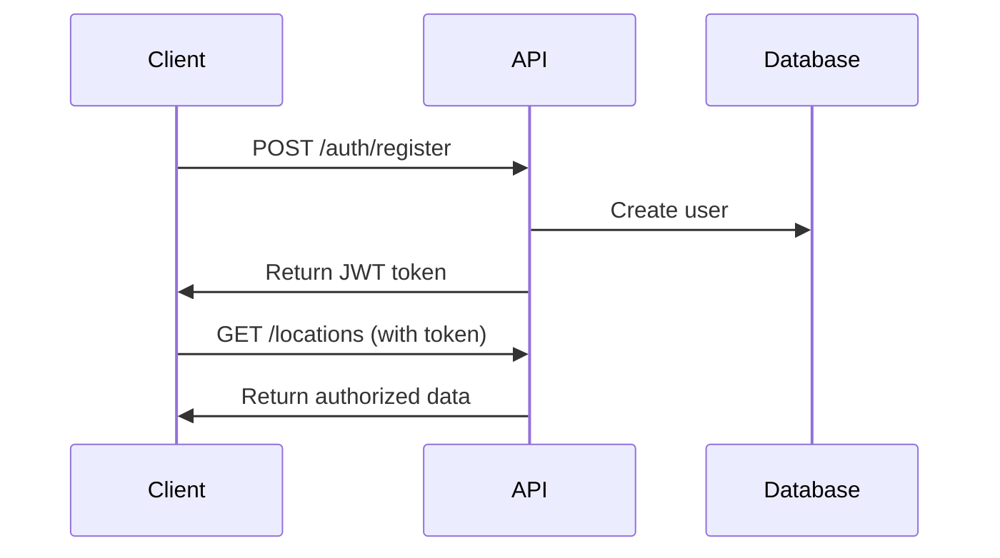
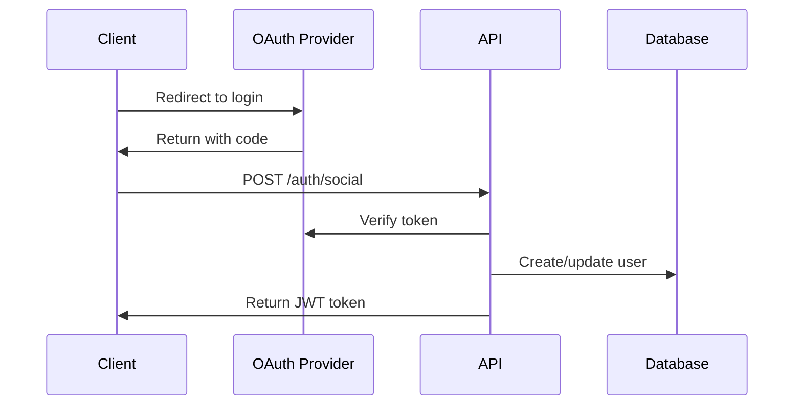

# Authentication

StorageSpace uses JWT (JSON Web Tokens) for authentication with OAuth2.0 social login support.

## Authentication Flow

### 1. Email/Password Authentication



### 2. Social Authentication (OAuth 2.0)

Supported providers:
- Google
- Apple
- Facebook



## Token Management

### Token Structure

```json
{
  "header": {
    "alg": "HS256",
    "typ": "JWT"
  },
  "payload": {
    "userId": "user_123",
    "email": "user@example.com",
    "role": "user",
    "iat": 1642521600,
    "exp": 1642608000
  }
}
```

### Token Lifecycle

- **Access Token**: Valid for 24 hours
- **Refresh Token**: Valid for 30 days
- **Session Management**: Tokens stored securely in device keychain

### Refresh Token Flow

```typescript
// Refresh token endpoint
POST /auth/refresh

// Request
{
  "refreshToken": "refresh_token_here"
}

// Response
{
  "accessToken": "new_access_token",
  "refreshToken": "new_refresh_token",
  "expiresIn": 86400
}
```

## Security Best Practices

### 1. Token Storage

**Mobile (React Native):**
```typescript
import * as SecureStore from 'expo-secure-store';

// Store token
await SecureStore.setItemAsync('accessToken', token);

// Retrieve token
const token = await SecureStore.getItemAsync('accessToken');

// Remove token
await SecureStore.deleteItemAsync('accessToken');
```

### 2. API Request Interceptor

```typescript
import axios from 'axios';

// Setup axios interceptor
axios.interceptors.request.use(
  async (config) => {
    const token = await SecureStore.getItemAsync('accessToken');
    if (token) {
      config.headers.Authorization = `Bearer ${token}`;
    }
    return config;
  },
  (error) => {
    return Promise.reject(error);
  }
);

// Handle token expiration
axios.interceptors.response.use(
  (response) => response,
  async (error) => {
    if (error.response?.status === 401) {
      // Try to refresh token
      const refreshToken = await SecureStore.getItemAsync('refreshToken');
      if (refreshToken) {
        try {
          const { data } = await axios.post('/auth/refresh', { refreshToken });
          await SecureStore.setItemAsync('accessToken', data.accessToken);
          
          // Retry original request
          error.config.headers.Authorization = `Bearer ${data.accessToken}`;
          return axios.request(error.config);
        } catch (refreshError) {
          // Redirect to login
          navigation.navigate('Login');
        }
      }
    }
    return Promise.reject(error);
  }
);
```

### 3. Biometric Authentication

Enable biometric authentication for enhanced security:

```typescript
import * as LocalAuthentication from 'expo-local-authentication';

// Check if biometric is available
const hasHardware = await LocalAuthentication.hasHardwareAsync();
const isEnrolled = await LocalAuthentication.isEnrolledAsync();

// Authenticate with biometric
if (hasHardware && isEnrolled) {
  const result = await LocalAuthentication.authenticateAsync({
    promptMessage: 'Authenticate to access StorageSpace',
    fallbackLabel: 'Use passcode',
  });
  
  if (result.success) {
    // Proceed with app access
  }
}
```

## Multi-Factor Authentication (MFA)

### SMS/Email OTP

```typescript
// Request OTP
POST /auth/mfa/request
{
  "userId": "user_123",
  "method": "sms" // or "email"
}

// Verify OTP
POST /auth/mfa/verify
{
  "userId": "user_123",
  "code": "123456"
}
```

### TOTP (Time-based One-Time Password)

```typescript
// Enable TOTP
POST /auth/mfa/totp/enable
Response: {
  "secret": "JBSWY3DPEHPK3PXP",
  "qrCode": "data:image/png;base64,..."
}

// Verify TOTP
POST /auth/mfa/totp/verify
{
  "userId": "user_123",
  "code": "123456"
}
```

## Session Management

### Active Sessions

Users can view and manage active sessions:

```typescript
// Get active sessions
GET /auth/sessions

// Response
{
  "sessions": [
    {
      "id": "sess_123",
      "device": "iPhone 14 Pro",
      "location": "New York, US",
      "lastActive": "2025-01-20T10:30:00Z",
      "current": true
    }
  ]
}

// Revoke session
DELETE /auth/sessions/:sessionId
```

## Security Headers

All authenticated requests should include:

```
Authorization: Bearer <token>
X-Request-ID: <unique-request-id>
X-Client-Version: 1.0.0
```

## Rate Limiting

Authentication endpoints have specific rate limits:

- Login: 5 attempts per 15 minutes
- Register: 3 attempts per hour
- Password reset: 3 attempts per hour
- MFA verification: 5 attempts per 5 minutes

## Error Handling

Common authentication errors:

```json
{
  "error": {
    "code": "INVALID_CREDENTIALS",
    "message": "Invalid email or password"
  }
}

{
  "error": {
    "code": "ACCOUNT_LOCKED",
    "message": "Account locked due to multiple failed attempts",
    "retryAfter": 900
  }
}

{
  "error": {
    "code": "TOKEN_EXPIRED",
    "message": "Access token has expired",
    "hint": "Use refresh token to get new access token"
  }
}
```