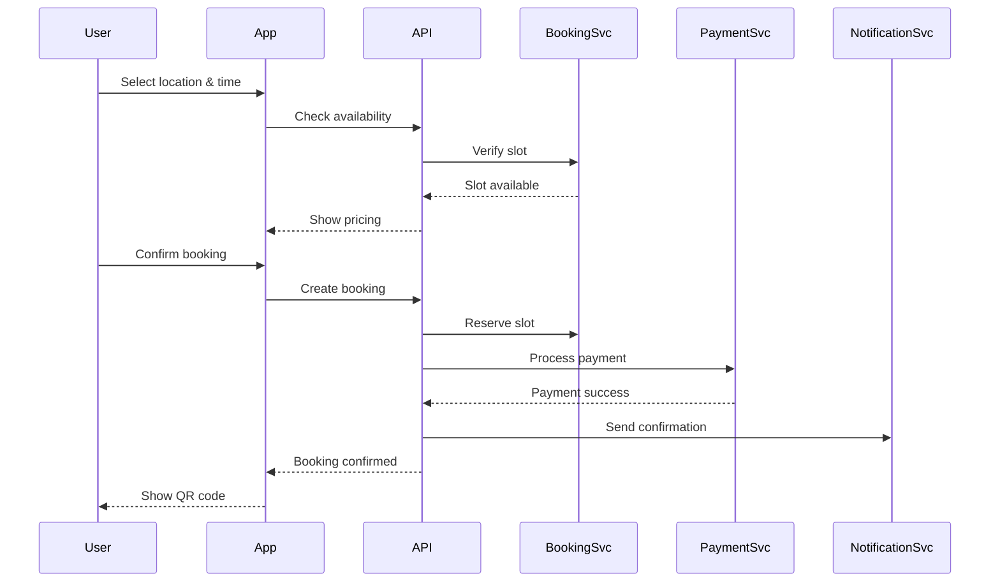

# System Architecture Overview

StorageSpace is built using a modern, scalable architecture designed for cross-platform mobile applications with real-time features and high availability.

## High-Level Architecture

```
┌─────────────────────────────────────────────────────────────┐
│                        Client Layer                          │
├─────────────────┬─────────────────┬─────────────────────────┤
│   iOS App       │   Android App   │      Web App            │
│  (React Native) │  (React Native) │   (React Native Web)    │
└────────┬────────┴────────┬────────┴────────┬────────────────┘
         │                 │                 │
         └─────────────────┴─────────────────┘
                           │
                    ┌──────▼──────┐
                    │   API Gateway│
                    │   (REST/WS)  │
                    └──────┬──────┘
                           │
        ┌──────────────────┼──────────────────┐
        │                  │                  │
┌───────▼────────┐ ┌───────▼────────┐ ┌──────▼──────┐
│  Auth Service  │ │Booking Service │ │Location Svc │
└───────┬────────┘ └───────┬────────┘ └──────┬──────┘
        │                  │                  │
        └──────────────────┼──────────────────┘
                           │
                    ┌──────▼──────┐
                    │   Database   │
                    │ (PostgreSQL) │
                    └─────────────┘
```

## Technology Stack

### Frontend
- **Framework**: React Native 0.72 with Expo SDK 49
- **Language**: TypeScript 5.0 with strict mode
- **State Management**: React Context + React Query for server state
- **Navigation**: React Navigation v6 with deep linking
- **UI Components**: Custom design system with Reanimated 3
- **Maps**: React Native Maps with clustering and heatmaps
- **Styling**: StyleSheet with dynamic theming system
- **Testing**: Jest + React Native Testing Library + Detox

### Backend Infrastructure
- **API Gateway**: Express.js with Helmet security
- **Language**: TypeScript with strict mode
- **Database**: PostgreSQL 15 with Prisma ORM
- **Cache**: Redis 7.0 with clustering
- **Queue**: BullMQ with Redis
- **Real-time**: Socket.io with WebSocket fallback
- **File Storage**: AWS S3 with CloudFront CDN
- **Search**: Elasticsearch 8.0 for location search

### Security & Compliance
- **Authentication**: JWT with refresh tokens + OAuth 2.0
- **Authorization**: RBAC with fine-grained permissions
- **Encryption**: AES-256 at rest, TLS 1.3 in transit
- **PCI DSS**: Compliant payment processing
- **SOC 2**: Type II compliance
- **GDPR**: Data protection compliance

### DevOps & Infrastructure
- **Cloud**: Multi-region AWS deployment
- **Containers**: Docker with ECS Fargate
- **CDN**: CloudFront with edge locations
- **Monitoring**: DataDog + Sentry + CloudWatch
- **Analytics**: Mixpanel + Firebase Analytics
- **CI/CD**: GitHub Actions with EAS Build
- **IaC**: Terraform for infrastructure management

## Core Components

### 1. Client Applications

#### Mobile Apps (iOS & Android)
- Single codebase using React Native
- Native modules for platform-specific features
- Offline-first architecture with local caching
- Push notifications via FCM/APNs

#### Web Application
- React Native Web for code sharing
- Progressive Web App (PWA) capabilities
- Responsive design for all screen sizes

### 2. API Gateway

- RESTful API design
- GraphQL support (future)
- Rate limiting and throttling
- API versioning
- Request/response validation
- Authentication middleware

### 3. Microservices

#### Authentication Service
- User registration/login
- JWT token management
- OAuth2.0 integration
- Session management
- MFA support

#### Booking Service
- Booking creation and management
- Payment processing
- Availability checking
- Pricing calculations
- Booking notifications

#### Location Service
- Location search and filtering
- Geospatial queries
- Availability management
- Rating and reviews
- Location analytics

#### Notification Service
- Push notifications
- Email notifications
- SMS notifications
- In-app notifications
- Notification preferences

### 4. Data Layer

#### Primary Database (PostgreSQL)
```sql
-- Core tables structure
Users
Locations
Bookings
Payments
Reviews
Notifications
```

#### Caching Layer (Redis)
- Session storage
- API response caching
- Real-time data
- Rate limiting counters

#### Search Engine (Elasticsearch)
- Full-text location search
- Faceted search
- Geo-spatial queries

## Data Flow

### Booking Flow Example



## Security Architecture

### Authentication & Authorization
- JWT-based authentication
- Role-based access control (RBAC)
- API key management
- OAuth2.0 for social login

### Data Security
- Encryption at rest (AES-256)
- Encryption in transit (TLS 1.3)
- PII data masking
- Secure key management (AWS KMS)

### Application Security
- Input validation and sanitization
- SQL injection prevention
- XSS protection
- CSRF tokens
- Rate limiting
- DDoS protection

## Scalability Considerations

### Horizontal Scaling
- Stateless services
- Load balancing (ALB/NLB)
- Auto-scaling groups
- Database read replicas

### Performance Optimization
- CDN for static assets
- Image optimization
- Lazy loading
- Code splitting
- API response caching

### High Availability
- Multi-AZ deployment
- Database failover
- Health checks
- Circuit breakers
- Graceful degradation

## Monitoring & Observability

### Application Monitoring
- Error tracking (Sentry)
- Performance monitoring
- User session replay
- Custom metrics

### Infrastructure Monitoring
- Server metrics (CPU, Memory, Disk)
- Database performance
- API latency tracking
- Uptime monitoring

### Logging
- Centralized logging (ELK stack)
- Structured logging
- Log aggregation
- Real-time alerts

## Development & Deployment

### Environments
1. **Development**: Local development
2. **Staging**: Pre-production testing
3. **Production**: Live environment

### CI/CD Pipeline
```yaml
1. Code Push → GitHub
2. Automated Tests
3. Build & Package
4. Deploy to Staging
5. Integration Tests
6. Deploy to Production
7. Post-deployment Tests
```

### Feature Flags
- Gradual rollouts
- A/B testing
- Quick rollbacks
- Environment-specific features

## Performance & Scalability

### Performance Targets
- **API Response Time**: < 200ms for 95th percentile
- **App Launch Time**: < 3 seconds cold start
- **Search Response**: < 100ms for location queries
- **Image Loading**: < 500ms for high-res images
- **Offline Support**: 24-hour offline capability

### Scalability Metrics
- **Concurrent Users**: 100,000+ simultaneous
- **API Throughput**: 10,000 requests/second
- **Database**: 10TB+ data with sub-second queries
- **Global Coverage**: 50+ countries, 5 regions
- **Availability**: 99.9% uptime SLA

### Caching Strategy
```
┌─────────────────┐    ┌─────────────────┐    ┌─────────────────┐
│   CDN Cache     │    │   API Cache     │    │  Database Cache │
│   (CloudFront)  │    │   (Redis)       │    │   (Redis)       │
│   TTL: 24h      │────▶   TTL: 5min     │────▶   TTL: 1min     │
│   Static Assets │    │   API Responses │    │   Query Results │
└─────────────────┘    └─────────────────┘    └─────────────────┘
```

## Future Considerations

### Roadmap 2025-2026
1. **GraphQL Federation**: Unified API gateway
2. **Microservices Architecture**: Domain-driven services
3. **Event Sourcing**: Complete audit trail
4. **CQRS Implementation**: Optimized read/write paths
5. **Service Mesh**: Istio for service communication
6. **AI/ML Integration**: Predictive analytics and recommendations

### Emerging Technologies
1. **Edge Computing**: Cloudflare Workers for low latency
2. **WebAssembly**: Performance-critical calculations
3. **Serverless**: AWS Lambda for event processing
4. **Kubernetes**: Container orchestration for scale
5. **Blockchain**: Decentralized identity and payments
6. **IoT Integration**: Smart locker connectivity

### Compliance & Security Evolution
1. **Zero Trust Architecture**: Comprehensive security model
2. **Privacy by Design**: Enhanced data protection
3. **Quantum-Safe Cryptography**: Future-proof encryption
4. **Real-time Threat Detection**: AI-powered security
5. **Compliance Automation**: Continuous compliance monitoring