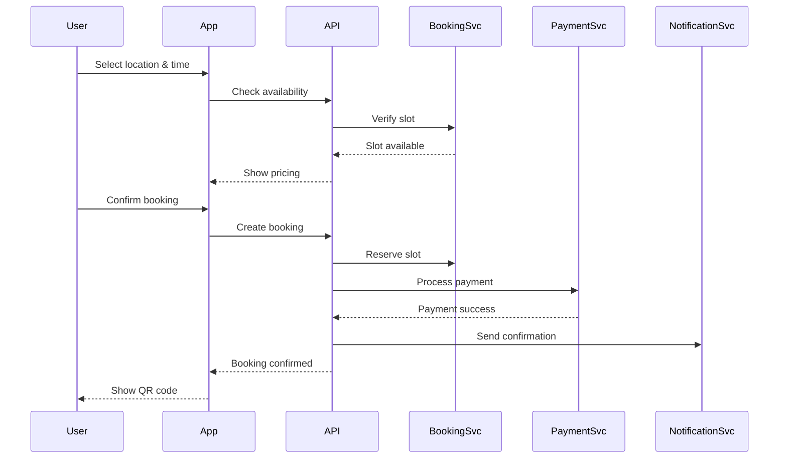

# System Architecture Overview

StorageSpace is built using a modern, scalable architecture designed for cross-platform mobile applications with real-time features and high availability.

## High-Level Architecture

```
┌─────────────────────────────────────────────────────────────┐
│                        Client Layer                          │
├─────────────────┬─────────────────┬─────────────────────────┤
│   iOS App       │   Android App   │      Web App            │
│  (React Native) │  (React Native) │   (React Native Web)    │
└────────┬────────┴────────┬────────┴────────┬────────────────┘
         │                 │                 │
         └─────────────────┴─────────────────┘
                           │
                    ┌──────▼──────┐
                    │   API Gateway│
                    │   (REST/WS)  │
                    └──────┬──────┘
                           │
        ┌──────────────────┼──────────────────┐
        │                  │                  │
┌───────▼────────┐ ┌───────▼────────┐ ┌──────▼──────┐
│  Auth Service  │ │Booking Service │ │Location Svc │
└───────┬────────┘ └───────┬────────┘ └──────┬──────┘
        │                  │                  │
        └──────────────────┼──────────────────┘
                           │
                    ┌──────▼──────┐
                    │   Database   │
                    │ (PostgreSQL) │
                    └─────────────┘
```

## Technology Stack

### Frontend
- **Framework**: React Native with Expo
- **Language**: TypeScript
- **State Management**: React Context + Hooks (Redux ready)
- **Navigation**: React Navigation v6
- **UI Components**: Custom components with React Native Elements
- **Maps**: React Native Maps (Google Maps)
- **Styling**: StyleSheet with themed components

### Backend (Planned)
- **API**: Node.js with Express/Fastify
- **Language**: TypeScript
- **Database**: PostgreSQL with Prisma ORM
- **Cache**: Redis
- **Queue**: Bull/BullMQ
- **Real-time**: Socket.io
- **File Storage**: AWS S3 / Cloudinary

### Infrastructure
- **Hosting**: AWS ECS / Google Cloud Run
- **CDN**: CloudFront / Cloudflare
- **Monitoring**: Sentry, DataDog
- **Analytics**: Mixpanel, Google Analytics
- **CI/CD**: GitHub Actions

## Core Components

### 1. Client Applications

#### Mobile Apps (iOS & Android)
- Single codebase using React Native
- Native modules for platform-specific features
- Offline-first architecture with local caching
- Push notifications via FCM/APNs

#### Web Application
- React Native Web for code sharing
- Progressive Web App (PWA) capabilities
- Responsive design for all screen sizes

### 2. API Gateway

- RESTful API design
- GraphQL support (future)
- Rate limiting and throttling
- API versioning
- Request/response validation
- Authentication middleware

### 3. Microservices

#### Authentication Service
- User registration/login
- JWT token management
- OAuth2.0 integration
- Session management
- MFA support

#### Booking Service
- Booking creation and management
- Payment processing
- Availability checking
- Pricing calculations
- Booking notifications

#### Location Service
- Location search and filtering
- Geospatial queries
- Availability management
- Rating and reviews
- Location analytics

#### Notification Service
- Push notifications
- Email notifications
- SMS notifications
- In-app notifications
- Notification preferences

### 4. Data Layer

#### Primary Database (PostgreSQL)
```sql
-- Core tables structure
Users
Locations
Bookings
Payments
Reviews
Notifications
```

#### Caching Layer (Redis)
- Session storage
- API response caching
- Real-time data
- Rate limiting counters

#### Search Engine (Elasticsearch)
- Full-text location search
- Faceted search
- Geo-spatial queries

## Data Flow

### Booking Flow Example



## Security Architecture

### Authentication & Authorization
- JWT-based authentication
- Role-based access control (RBAC)
- API key management
- OAuth2.0 for social login

### Data Security
- Encryption at rest (AES-256)
- Encryption in transit (TLS 1.3)
- PII data masking
- Secure key management (AWS KMS)

### Application Security
- Input validation and sanitization
- SQL injection prevention
- XSS protection
- CSRF tokens
- Rate limiting
- DDoS protection

## Scalability Considerations

### Horizontal Scaling
- Stateless services
- Load balancing (ALB/NLB)
- Auto-scaling groups
- Database read replicas

### Performance Optimization
- CDN for static assets
- Image optimization
- Lazy loading
- Code splitting
- API response caching

### High Availability
- Multi-AZ deployment
- Database failover
- Health checks
- Circuit breakers
- Graceful degradation

## Monitoring & Observability

### Application Monitoring
- Error tracking (Sentry)
- Performance monitoring
- User session replay
- Custom metrics

### Infrastructure Monitoring
- Server metrics (CPU, Memory, Disk)
- Database performance
- API latency tracking
- Uptime monitoring

### Logging
- Centralized logging (ELK stack)
- Structured logging
- Log aggregation
- Real-time alerts

## Development & Deployment

### Environments
1. **Development**: Local development
2. **Staging**: Pre-production testing
3. **Production**: Live environment

### CI/CD Pipeline
```yaml
1. Code Push → GitHub
2. Automated Tests
3. Build & Package
4. Deploy to Staging
5. Integration Tests
6. Deploy to Production
7. Post-deployment Tests
```

### Feature Flags
- Gradual rollouts
- A/B testing
- Quick rollbacks
- Environment-specific features

## Future Considerations

### Planned Enhancements
1. **GraphQL API**: For more efficient data fetching
2. **Microservices**: Break down monolith further
3. **Event Sourcing**: For audit trails
4. **CQRS**: Separate read/write models
5. **Service Mesh**: For service communication

### Scaling Strategies
1. **Global Distribution**: Multi-region deployment
2. **Edge Computing**: CDN edge functions
3. **Serverless**: For specific workloads
4. **Container Orchestration**: Kubernetes adoption